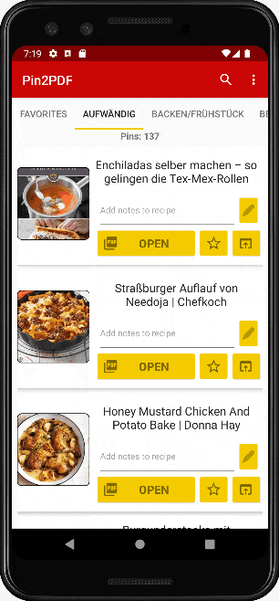

#  Pin2PDF  

* Show Pinterest Boards of your Account
* Page Size of 250 per Board
* Automatic download of the recipe as .PDF File
* Take additional Notes for Pins

## TODO
* Star-Rating for each Recipe
* Offline Mode
* Option to scrape only from specific Pinterest boards

## Done
* RecyclerView of Pins with Image + Title
* Pinterest API to get Boards + Pins of User
* Opens Recipe link directly when clicked on title
* Separate Boards of User in Tabs
* Loading Animations
* Store tagged Recipes/Pins in local database
* Scrape .PDF/Print links of each recipe's website
* Check if Pins were removed
* List with Material Cards
* Option to add Notes to a Recipe in ListView
* Add Search Bar Functionality
* Download/Print recipes to local .PDF Files
* Favorites List
